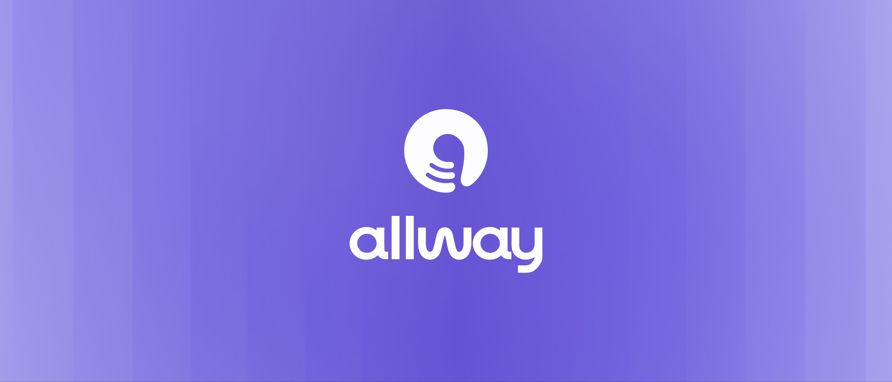
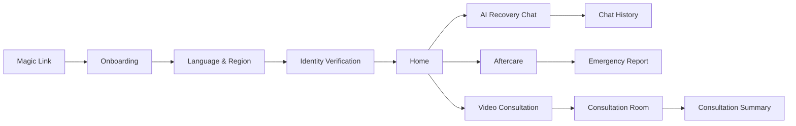
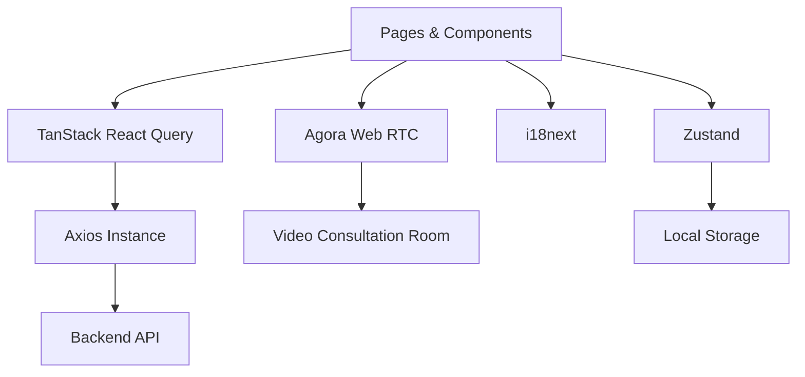

<div align="center">
  

  <br>

</div>
<div align="center">

# allway

시술 후 회복부터 AI 상담, 사후관리, 화상 상담까지  
환자의 회복 여정을 하나로 연결하는 맞춤형 케어 서비스

<br />


<br />

**[Live Demo](https://allway-demo.vercel.app)** · **[성능 개선 기록](./docs/performance)** · **[목 API 구성](./docs/api-mocking)**

</div>

---

## About allway

**allway**는 시술 이후 환자가 겪는 정보 부족과 불안을 줄이기 위한 회복 지원 서비스입니다.

환자는 자신의 시술 정보와 회복 단계에 맞는 안내를 확인하고, AI에게 현재 증상을 질문하거나 사진을 첨부해 상담할 수 있습니다. 필요한 경우 의료진과 화상 상담을 진행하고, 상담 내용과 사후관리 정보를 지속해서 확인할 수 있습니다.

> allway에서 제공하는 정보는 회복을 돕기 위한 참고 자료이며, 의료진의 진단이나 처방을 대신하지 않습니다.

---

## Core Experience

| 기능 | 설명 |
| --- | --- |
| **Personalized Onboarding** | 언어, 국가, 시간대와 생년월일을 확인해 사용자 환경을 설정합니다. |
| **AI Recovery Chat** | 회복 과정에서 궁금한 증상을 질문하고 사진을 첨부할 수 있습니다. |
| **Aftercare Timeline** | 시술 후 경과일과 현재 회복 단계, 주의사항을 확인합니다. |
| **Emergency Report** | 응급 상황에서 현지 의료진에게 보여줄 영문 의료 요약을 제공합니다. |
| **Video Consultation** | 의료진과 1:1 화상 상담을 예약하고 진행합니다. |
| **Consultation Summary** | 상담 내용과 의료진 안내 사항을 다시 확인할 수 있습니다. |
| **Multilingual UI** | 한국어, 영어, 일본어, 중국어를 지원합니다. |

---

## User Flow



---

## Tech Stack

| 영역 | 기술 |
| --- | --- |
| UI | React 19, TypeScript 6 |
| Build | Vite 8 |
| Styling | Tailwind CSS 4, CSS Design Tokens |
| Routing | React Router 7 |
| Server State | TanStack React Query 5 |
| Client State | Zustand 5 |
| HTTP Client | Axios |
| RTC | Agora Web RTC |
| Internationalization | i18next, react-i18next |
| Code Quality | ESLint |
| Package Manager | npm |

---

## Getting Started

### Requirements

- Node.js `20.19.0` 이상 또는 `22.12.0` 이상
- npm
- allway Backend API

> Node.js 버전 기준은 현재 프로젝트에서 사용하는 Vite 8의 실행 조건을 따릅니다.

### Installation

```bash
git clone <repository-url>
cd middle

npm ci
```

일반적인 로컬 설치가 필요한 경우 다음 명령도 사용할 수 있습니다.

```bash
npm install
```

### Environment Variables

루트의 `.env.example`을 복사해 `.env` 파일을 생성합니다.

```bash
cp .env.example .env
```

```env
VITE_API_BASE_URL=https://your-api-server.com
```

| 환경변수 | 설명 | 필수 |
| --- | --- | --- |
| `VITE_API_BASE_URL` | Backend API 기본 주소 | Yes |

> `VITE_` 접두사가 붙은 값은 클라이언트 번들에 포함될 수 있으므로 비밀 키를 저장하면 안 됩니다.

### Run

```bash
npm run dev
```

Vite 기본 개발 서버는 일반적으로 다음 주소에서 실행됩니다.

```text
http://localhost:5173
```

---

## Scripts

| 명령어 | 설명 |
| --- | --- |
| `npm run dev` | 개발 서버를 실행합니다. |
| `npm run build` | TypeScript 검사 후 프로덕션 빌드를 생성합니다. |
| `npm run preview` | 프로덕션 빌드를 로컬에서 미리 확인합니다. |
| `npm run lint` | 전체 프로젝트의 ESLint 검사를 실행합니다. |

PR 생성 전에는 최소한 아래 명령을 실행해 주세요.

```bash
npm run lint
npm run build
```

---

## Routes

### Onboarding & Home

| 경로 | 설명 |
| --- | --- |
| `/` | 스플래시 및 온보딩 |
| `/patient/access?token=...` | 매직링크 기반 사용자 인증 진입점 |
| `/home` | 회복 현황, AI 채팅, 상담 및 사후관리 대시보드 |
| `/settings/language` | 언어 설정 |

### Aftercare

| 경로 | 설명 |
| --- | --- |
| `/aftercare` | 경과일, 회복 단계 및 주의사항 |
| `/aftercare/emergency-report` | 응급 상황용 영문 의료 요약 |

### Consultation

| 경로 | 설명 |
| --- | --- |
| `/consultation` | 상담 내역 및 진행 중인 상담 |
| `/consultation/reservation` | 상담 일정 선택 화면으로 이동 |
| `/consultation/reservation/schedule` | 상담 가능 날짜 및 시간 선택 |
| `/consultation/reservation/pre-consultation` | 사전 상담 정보 및 사진 제출 |
| `/consultation/:appointmentId/confirmed` | 상담 예약 확정 |
| `/consultation/:appointmentId/cancelled` | 상담 취소 결과 |
| `/consultation/:appointmentId/details` | 상담 상세 정보 |
| `/consultation/:appointmentId/waiting` | 카메라 및 마이크 사전 확인 |
| `/consultation/:appointmentId/room` | 1:1 화상 상담 |
| `/consultation/summary/:summaryId` | 상담 요약 및 의료진 안내 |

---

## Project Structure

```text
src/
├── apis/                    # Backend API 요청
│   └── consultation/        # 상담 관련 API
├── assets/                  # 이미지 및 아이콘
│   ├── aftercare/           # 사후관리 에셋
│   ├── brand/               # 브랜드 로고
│   ├── common/              # 공통 UI 에셋
│   ├── home/                # 홈 화면 에셋
│   ├── icons/               # 상담 등 기존 기능 아이콘
│   ├── onboarding/          # 온보딩 배경 및 글로우
│   ├── settings/            # 설정 화면 에셋
│   ├── shared/              # 여러 화면에서 공유하는 에셋
│   └── splash/              # 스플래시 로고
├── components/              # 재사용 가능한 UI 컴포넌트
├── constants/               # 공통 상수와 옵션
├── hooks/                   # 커스텀 React Hook
├── i18n/                    # 다국어 설정 및 번역 리소스
├── layouts/                 # 공통 페이지 레이아웃
├── pages/                   # 라우트별 페이지
├── routes/                  # React Router 설정
├── stores/                  # Zustand 클라이언트 상태
├── styles/                  # 전역 스타일과 디자인 토큰
├── types/                   # API 및 도메인 타입
└── utils/                   # 공통 유틸리티
```

---

## Architecture



### Server State

서버에서 가져오는 데이터는 TanStack React Query로 관리합니다.

- AI 채팅 내역
- 상담 예약 및 내역
- 사후관리 정보
- 상담 요약
- 첨부 이미지

### Client State

화면 간에 유지해야 하는 상태는 Zustand로 관리합니다.

- 현재 AI 채팅방
- 상담방 입장 정보
- 상담 예약 상태
- 언어 및 시간대 설정

### API Client

공통 Axios 인스턴스는 다음 역할을 담당합니다.

- `VITE_API_BASE_URL` 적용
- Access Token 기반 Bearer 인증
- JSON 요청 헤더 설정
- 이미지 업로드를 위한 `FormData` 처리
- 인증이 필요한 첨부 이미지 조회

---

## Performance

번들 크기와 로딩 속도를 측정 → 개선 → 재측정 사이클로 다뤘습니다.
측정 조건과 과정은 [`docs/performance`](./docs/performance)에 전부 기록돼 있습니다.

### 결과

| 지표 | 개선 전 | 개선 후 | 변화 |
| --- | --- | --- | --- |
| 초기 로드 JS | 2,375.86 kB | 810.27 kB | **-65.9%** |
| 배경 이미지 | 1,251.52 kB | 89.07 kB | **-92.9%** |
| PWA 프리캐시 | 2,395 KiB | 869 KiB | **-63.7%** |
| LCP | 6,929 ms | 4,565 ms | **-34.1%** |
| FCP | 6,682 ms | 4,333 ms | **-35.2%** |
| Lighthouse Performance | 56 | 68 | **+12** |

> LCP · FCP · Performance 는 각 빌드 5회 측정의 중앙값입니다.
> 기준 커밋 `e92cff3` 과 개선 후 `28e69ee` 를 같은 조건에서 측정해 비교했습니다.

### 개선 항목

| 작업 | 내용 | 문서 |
| --- | --- | --- |
| **아이콘 최적화** | SVG 안에 base64 로 박혀 있던 래스터 이미지를 벡터로 교체. 2.1 MB → 3.3 KB | [02](./docs/performance/02-icon-optimization.md) |
| **라우트 코드 스플리팅** | 화상 상담(Agora SDK)을 `lazy` 로 분리하고 PWA 프리캐시에서 제외. 진입 지연은 대기실 선로딩으로 상쇄 | [03](./docs/performance/03-code-splitting.md) |
| **배경 이미지 최적화** | PNG 3장을 WebP 로 교체. 1,251 kB → 89 kB | [04](./docs/performance/04-background-images.md) |
| **재측정** | 5회 중앙값으로 실제 개선 효과 확인 | [05](./docs/performance/05-lighthouse.md) |

### 측정 방법

번들 크기처럼 **빌드하면 같은 값이 나오는 결정론적 지표**를 1차 기준으로 삼습니다.
Lighthouse 는 편차가 커서(동일 빌드 3회에 Performance 35~44) 단독 근거로 쓰지 않고,
**각 빌드 5회 측정의 중앙값**만 사용합니다.

```bash
npm run build
npx vite preview --port 4173

# 측정 대상이 맞는지 빌드 해시로 먼저 확인한다
curl -s http://localhost:4173/ | grep -o 'index-[A-Za-z0-9_-]*\.js'

npx lighthouse http://localhost:4173/ \
  --output=json --output-path=./run1.json \
  --chrome-flags="--headless=new" --only-categories=performance --quiet
```

> 빌드 해시 확인이 절차에 들어간 이유는, 포트가 밀려 엉뚱한 서버를 측정하고
> "개선 효과 없음"이라는 잘못된 결론을 낸 적이 있기 때문입니다. ([05](./docs/performance/05-lighthouse.md) 참고)

### 남은 병목

현재 LCP 4,565 ms 중 **약 4,000 ms 는 스플래시 최소 노출 시간**(`SPLASH_DURATION`)입니다.
네트워크나 번들이 아니라 의도된 애니메이션 시간이므로, 이 수치를 로딩 성능으로 읽으면 안 됩니다.
추가 개선의 가장 큰 항목이지만 성능이 아니라 기획·디자인 결정 사안입니다.

---

## Internationalization

allway는 다음 언어를 지원합니다.

| Locale | 언어 |
| --- | --- |
| `ko-KR` | 한국어 |
| `en-US` | English |
| `ja-JP` | 日本語 |
| `zh-CN` | 简体中文 |

번역 리소스는 아래 경로에서 관리합니다.

```text
src/i18n/resources/
├── ko-KR/
├── en-US/
├── ja-JP/
└── zh-CN/
```

기본 fallback 언어는 `en-US`입니다.

---

## Design System

전역 디자인 토큰은 다음 파일의 Tailwind CSS 4 `@theme` 블록에서 관리합니다.

```text
src/styles/index.css
```

```css
@theme {
  --color-primary: #684bdb;
  --color-text-01: #2a2a2a;
  --color-care-bg: #f6f6f9;
  --color-onboarding-bg: #e1e9ff;
  --container-app: 430px;
}
```

CSS 변수는 Tailwind 유틸리티 클래스로 사용할 수 있습니다.

```tsx
<h1 className="text-title text-text-01">Title</h1>

<button className="bg-primary text-neutral-white">
  Continue
</button>
```

### Styling Principles

- 반복해서 사용하는 색상은 직접 입력하지 않고 의미 기반 토큰으로 추가합니다.
- 페이지 전용 토큰은 기능 이름을 접두사로 사용합니다.
- 모바일 화면을 기준으로 구현합니다.
- 데스크톱에서도 최대 `430px`의 앱 레이아웃을 유지합니다.
- 공통 컴포넌트는 `cn()`으로 외부 스타일 확장을 허용합니다.
- 모션은 `prefers-reduced-motion` 환경을 고려합니다.

### Typography

| 용도 | 클래스 | 크기 |
| --- | --- | --- |
| Display | `text-display` | 48px |
| Title | `text-title` | 36px |
| Heading | `text-heading` | 20px |
| Body | `text-body` | 16px |
| Caption | `text-caption` | 14px |

- 기본 폰트: Pretendard Variable
- 영문 Display 폰트: Poppins
- Pretendard와 Poppins는 외부 CDN을 통해 로드됩니다.

---

## Branch Strategy

allway는 `dev`를 개발 통합 브랜치로 사용하는 브랜치 전략을 따릅니다.

```text
main
└── dev
    ├── feature/*
    ├── fix/*
    ├── refactor/*
    └── chore/*
```

| 브랜치 | 용도 |
| --- | --- |
| `main` | 배포 가능한 안정 버전 |
| `dev` | 기능 통합 및 최종 테스트 |
| `feature/*` | 신규 기능 개발 |
| `fix/*` | 버그 수정 |
| `refactor/*` | 코드 구조 개선 |
| `chore/*` | 설정, 문서 및 기타 작업 |

### Branch Naming

```text
feature/home-page
fix/chat-scroll
refactor/consultation-state
chore/update-readme
```

---

## Commit Convention

```text
type: 작업 내용
```

| Type | 설명 |
| --- | --- |
| `feat` | 새로운 기능 |
| `fix` | 버그 수정 |
| `style` | UI 및 스타일 변경 |
| `refactor` | 기능 변경 없는 코드 개선 |
| `chore` | 설정, 에셋 및 기타 작업 |
| `docs` | 문서 수정 |

### Examples

```text
feat: 채팅 첨부 이미지 확대 기능 추가
fix: 메시지 전송 후 이전 대화 유지
style: 사후관리 카드 간격 조정
chore: 홈 에셋 폴더 구조 정리
docs: 프로젝트 실행 방법 추가
```

---

## Pull Request

모든 기능 브랜치는 `dev` 브랜치를 대상으로 Pull Request를 생성합니다.

PR 생성 전 확인해 주세요.

- [ ] 최신 `dev` 브랜치를 반영했습니다.
- [ ] `npm run lint`를 통과했습니다.
- [ ] `npm run build`를 통과했습니다.
- [ ] 주요 기능을 직접 확인했습니다.
- [ ] 모바일 화면을 확인했습니다.
- [ ] 담당 범위 외 파일이 포함되지 않았습니다.
- [ ] 리뷰어가 확인해야 할 내용을 작성했습니다.

---

## Video Consultation Requirements

화상 상담 기능을 사용하려면 다음 조건이 필요합니다.

- 카메라 및 마이크 권한
- `navigator.mediaDevices.getUserMedia`를 지원하는 브라우저
- HTTPS 환경 또는 `localhost`
- 안정적인 네트워크 연결
- 상담방 및 Agora Token을 제공하는 Backend API

> Wi-Fi 또는 5G 환경 사용을 권장합니다.

---

## Deployment

React Router의 `createBrowserRouter`를 사용하므로 배포 서버는 모든 클라이언트 라우트를 `index.html`로 전달해야 합니다.

예를 들어 사용자가 아래 주소에 직접 접근해도 앱이 실행되어야 합니다.

```text
/aftercare
/consultation/123/details
/consultation/123/room
```

배포 환경에서 추가로 확인해야 할 항목은 다음과 같습니다.

- SPA fallback 또는 rewrite 설정
- Backend CORS 설정
- `VITE_API_BASE_URL` 설정
- HTTPS 적용
- 카메라 및 마이크 권한
- 외부 폰트 CDN 접근

### Mock API Demo

백엔드 없이 전체 플로우를 볼 수 있는 데모를 별도로 배포합니다.
`VITE_USE_MOCK_API=true` 로 빌드하면 MSW 가 API 응답을 대신합니다.

| | [데모](https://allway-demo.vercel.app) | 프로덕션 |
| --- | --- | --- |
| `VITE_USE_MOCK_API` | `true` | 미설정 |
| 데이터 | MSW 목 | 실서버 |
| PWA | 꺼짐 | 켜짐 |

플래그가 꺼진 빌드에서는 조건이 상수 `false` 로 접혀 **MSW 런타임과 픽스처가 번들에서 제거됩니다.**

```bash
VITE_USE_MOCK_API=false npm run build
grep -rl "mockServiceWorker" dist/assets/*.js   # 결과가 없어야 정상
```

> 데모에서 PWA 를 끄는 이유는 MSW 워커와 Workbox 워커가 모두 스코프 `/` 에 등록되는데
> 같은 스코프에는 서비스 워커가 하나만 남기 때문입니다.
> 자세한 구성은 [`docs/api-mocking`](./docs/api-mocking)에 있습니다.

---

## Medical Disclaimer

> allway는 사용자의 회복을 돕기 위한 안내 서비스를 제공합니다.  
> 제공되는 정보는 의료적 진단이나 처방을 대신하지 않습니다.  
> 증상이 악화되거나 위험 신호가 나타나는 경우 시술 병원 또는 현지 응급기관에 즉시 연락해 주세요.

---

## Team

| 이름 | 역할 | GitHub |
| --- | --- | --- |
| 최용주 | Frontend | [YJEND](https://github.com/YJEND) |
| 고명준 | Frontend | [kmj0973](https://github.com/kmj0973) |

---

<div align="center">


**Likelion_14th_allway**

</div>
